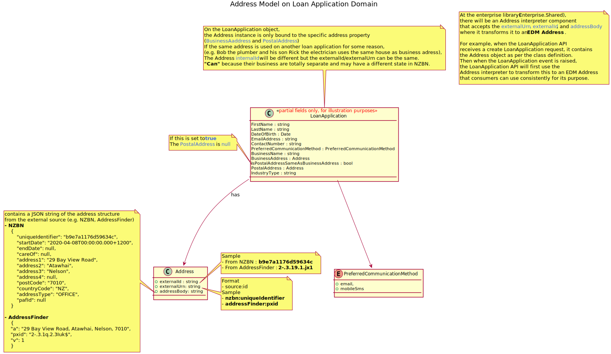
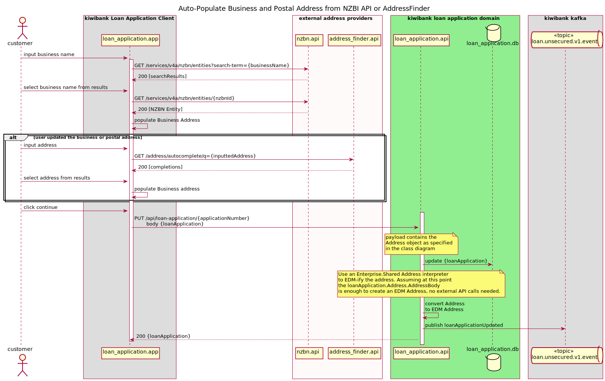
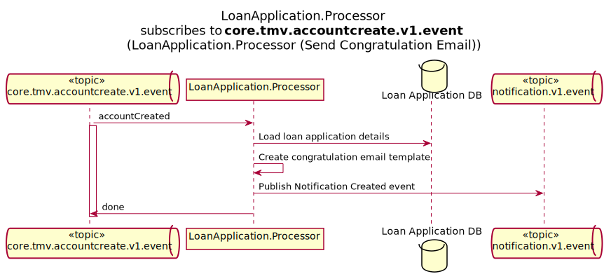

# Loan Application Domain

Origination of a customer loan including loan offer and acceptance. The domain is responsible to create/update loan application within Kiwibank domain.

## Service Register

### LoanApplication.Api 
  - Local HTTP Port: 50200
  - Provides set of APIs to create, update and accept loan applications

#### Address Model



#### Address EDM-ification


### LoanApplication.Processor
  - Local HTTP Port: 50201
  
#### Currently subscribed to events from account domain to send congratulation email out once the loan account is created in Thought Machine.



## Start the local environment only for LoanApplication domain

-   To run local environment execute following commands:

```bash
./code/loanApplication/scripts/run-docker-compose.sh
```

By default every script will execute `docker compose up -d --build` command, but you can provide required `docker compose` command as a script argument, for example:

-   To run the docker compose with different arguments, you can override it as follow:

```bash
./code/loanApplication/scripts/run-docker-compose.sh "build --parallel"
./code/loanApplication/scripts/run-docker-compose.sh "up --build"
./code/loanApplication/scripts/run-docker-compose.sh up
./code/loanApplication/scripts/run-docker-compose.sh "up -d"
./code/loanApplication/scripts/run-docker-compose.sh restart
./code/loanApplication/scripts/run-docker-compose.sh down
```

## Useful commands

### View container status

```bash
./code/loanApplication/scripts/run-docker-compose.sh "ps"
```

### View logs

```bash
./code/loanApplication/scripts/run-docker-compose.sh "logs loanapplication-api"
./code/loanApplication/scripts/run-docker-compose.sh "logs loanapplication-processor"
```

## DB Migration

[Please refer to Shared project readme file.](./LoanApplication.Shared/readme.md)

## Run test locally

* [Run LoanApplication.Shared Unit Tests](./LoanApplication.Shared.UnitTests/readme.md)
* [Run LoanApplication.Api Unit Tests.](./LoanApplication.Api.UnitTests/readme.md)
* [Run LoanApplication.Api Integration Tests.](./LoanApplication.Api.IntegrationTests/readme.md)
* [Run LoanApplication.Processor Unit Tests.](./LoanApplication.Processor.UnitTests/readme.md)
* [Run LoanApplication.Processor Integration Tests.](./LoanApplication.Processor.IntegrationTests/readme.md)
